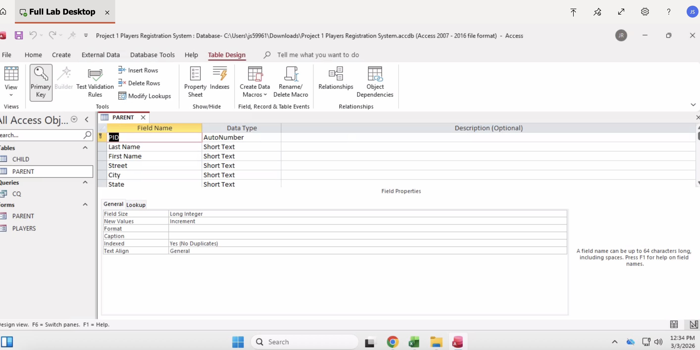
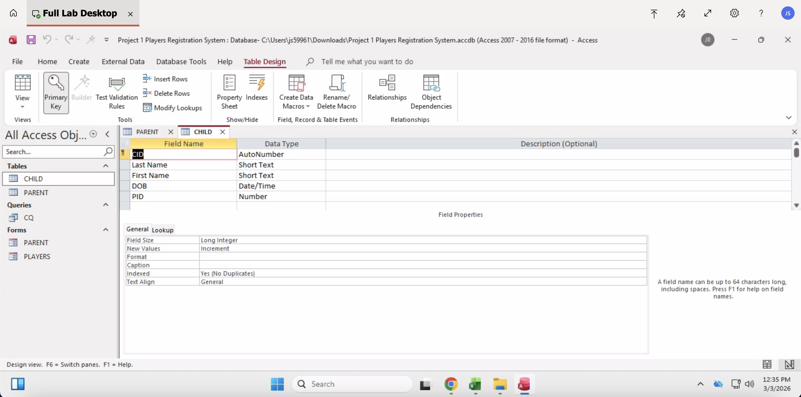
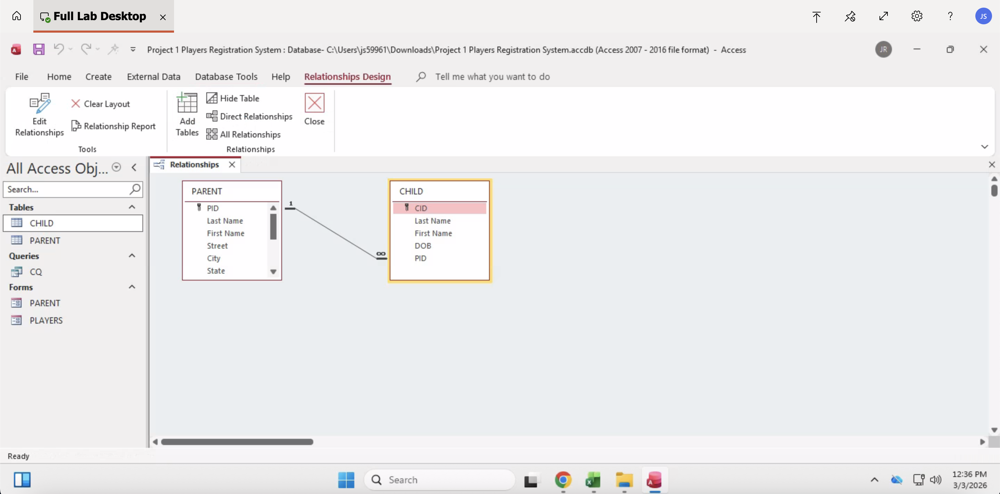
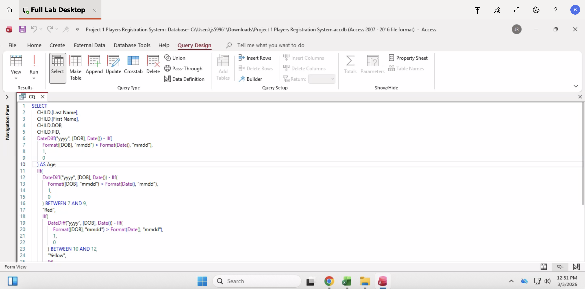

# Players Registration System

## Overview
Developed a normalized relational database system using Microsoft Access to manage player registration data efficiently. The system enforces data integrity through structured relationships and reduces redundancy using normalization principles (1NF–3NF).

## Tools Used
- Microsoft Access
- SQL Queries
- Relational Database Design
- Normalization (1NF–3NF)

## Key Features
- Designed multiple related tables with primary and foreign keys
- Established relationships to enforce referential integrity
- Built user-friendly data entry forms
- Created queries to retrieve and filter player data
- Generated structured reports for organized data presentation

## Skills Demonstrated
- Database normalization
- Relational schema design
- Query development
- Data validation
- Structured data management

## Database Design Screenshots

### Parent Table (Design View)

### Child Table (Design View)

### Relationship Diagram

### SQL Query Example

